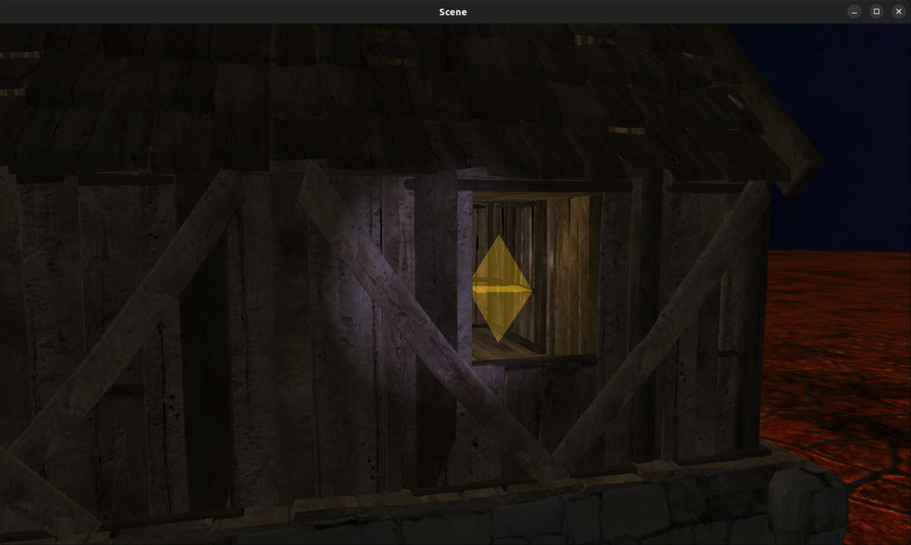
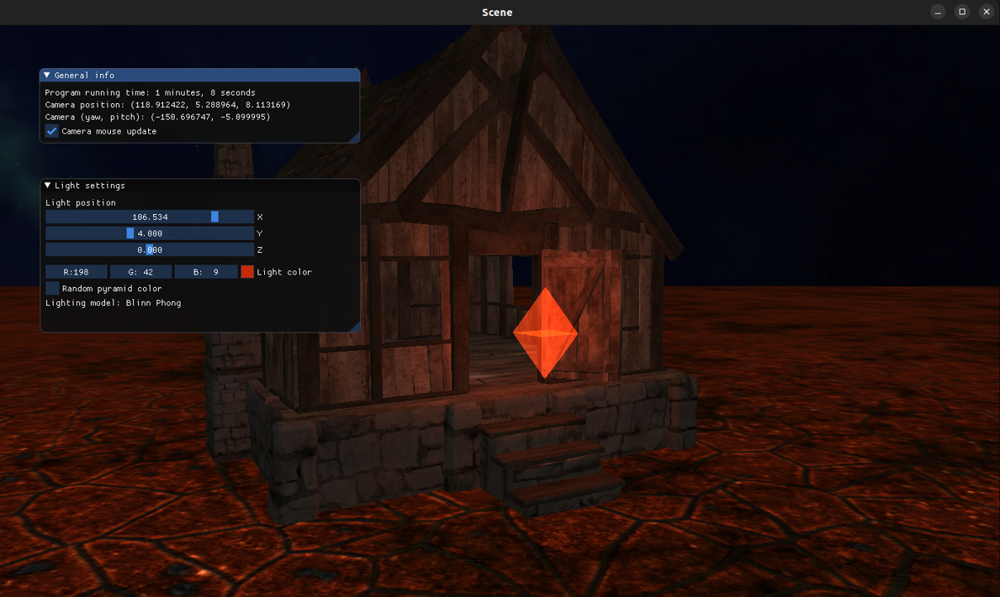
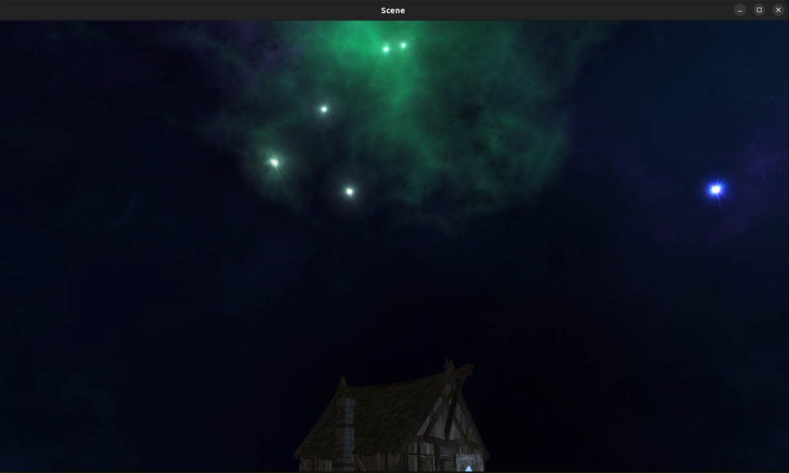
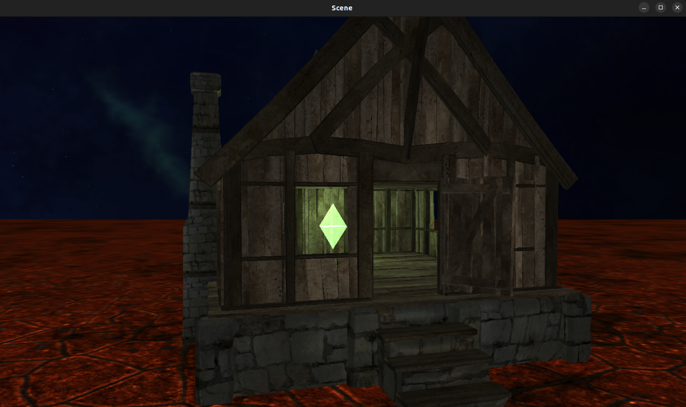

> # Project description
>
> Project made for the **Computer Graphics** course, as part of the studies at the Faculty of Mathematics, University of Belgrade.
>
> **Professor**: [dr Vesna Marinković](https://poincare.matf.bg.ac.rs/~vesna.marinkovic/)
>
> **Teaching Assistant**: [Marko Spasić](https://github.com/spaske00)
>
> <hr>
>
> ## Features
>
> - Basic techniques:
>   - **Colors**
>   - **Textures**
>   - **Camera**
>   - **Models**
>   - **Lighting**
>   - **ImGui**
>   - **Blending**
>
>
> - Advanced techniques:
>   - **Cubemaps** (**Skybox**)
>
> <hr>
>
> ## Dependencies
>
> ```
> sudo apt-get install g++ cmake git build-essential libgl1-mesa-dev libsoil-dev libglm-dev libassimp-dev libglew-dev libglfw3-dev libxinerama-dev libxcursor-dev libxi-dev mesa-common-dev mesa-utils libxxf86vm-dev libfreetype6-dev
> ```
>
> <hr>
>
> ## Build
>
> 1. ``git clone https://github.com/DavidT01/graphics_project.git``
> 2. CLion -> Open -> path/to/my/project_base
> 3. Main in src/main.cpp
> 4. ALT+SHIFT+F10 -> project_base -> run
>
> <hr>
>
> ## Commands
>
> `W` - Move Forward
>
> `S` - Move Backward
>
> `A` - Move Left
>
> `D` - Move Right
> 
> `Mouse` - Look Around
>
> `Scroll` - Zoom In/Out
>
> `F` - Flashlight On/Off
> 
> `L` - Random Light Color On/Off
>
> `SPACE` - Lighting Model Switch
> 
> `F1` - Toggle Menu
>
> `Esc` - Exit
>
> <hr>
>
> ## Resources
>
> - Initial commit from [course repository](https://github.com/matf-racunarska-grafika/project_base).
> - Majority of code based on [LearnOpenGL](https://github.com/JoeyDeVries/LearnOpenGL).
> - [Nebula Skybox](https://opengameart.org/content/space-nebulas-skybox)
> - [House model](https://github.com/matf-racunarska-grafika-galerija/OpenGL_matf_project)
>
> <hr>
>
> ## Gallery
>
> 
> 
> 
> 